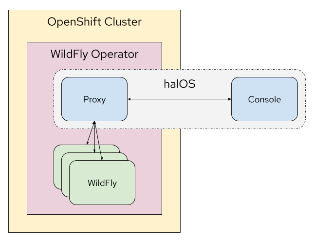

# halOS

halOS stands for HAL on OpenShift. It's a special [HAL](https://hal.github.io/) edition for WildFly instances managed by the  [WildFly operator](https://github.com/wildfly/wildfly-operator) and running on OpenShift.

## Architecture

halOS consists of two parts:

1. Proxy
2. Console

This repository contains the console.  The is a [RIA](https://en.wikipedia.org/wiki/Rich_web_application) / [SPA](https://en.wikipedia.org/wiki/Single-page_application). The UI follows the design guidelines from [PatternFly](https://www.patternfly.org/v4/). 
